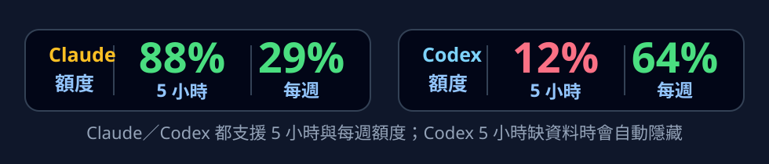

# CodexQuotaGauge

언어: [English](README.md) | [繁體中文](README.zh-TW.md) | [日本語](README.ja.md) | **한국어**

Windows 11 작업 표시줄 근처에 표시되는 사용량 위젯입니다. Codex 남은 사용량을 크고 읽기 쉬운 숫자로 보여 줍니다. Claude 사용량 지원 코드도 남아 있지만, 기본값은 꺼짐이며 필요할 때 메뉴에서 다시 켤 수 있습니다.

## 미리 보기

현재 Codex 가 주간 사용량 데이터만 제공하는 경우, 위젯은 자동으로 주간 전용 컴팩트 레이아웃으로 전환됩니다.


Claude 와 Codex 를 모두 켜고, 5시간 및 주간 사용량 데이터를 모두 사용할 수 있는 경우:



## 기능

- Codex 주간 남은 사용량을 퍼센트로 표시합니다.
- OpenAI 가 Codex 5시간 사용량 데이터를 제공하지 않을 때 Codex 5시간 칸을 자동으로 숨깁니다.
- Claude 사용량 모니터링 기능은 유지되지만 기본값은 꺼짐입니다.
- 우클릭 메뉴에서 새로고침, 상세 정보, Claude 켜기／끄기, 종료를 사용할 수 있습니다.
- Windows 시작 시 자동으로 실행됩니다.

## 설치

1. 이 저장소를 다운로드하거나 clone 합니다.
2. `Install.bat` 을 더블클릭합니다.
3. 위젯이 Windows 작업 표시줄 알림 영역 근처에 표시됩니다.

설치 위치:

```text
%LOCALAPPDATA%\CodexQuotaGauge\app
```

## 제거

`Uninstall.bat` 을 더블클릭합니다.

제거 프로그램은 백그라운드 프로세스를 중지하고, 시작 프로그램 바로 가기와 로컬 상태 데이터를 삭제합니다.

```text
%LOCALAPPDATA%\CodexQuotaGauge
```

## 요구 사항

- Windows 11
- Codex Desktop 설치 및 로그인
- Claude 사용량 모니터링을 켜려면 Claude Desktop 설치 및 로그인

## 사용 방법

- 패널을 우클릭해 메뉴를 엽니다.
- `立即更新` 을 선택하면 사용량 데이터를 다시 읽습니다.
- `開啟詳細資訊` 를 선택하면 리셋 시간을 볼 수 있습니다.
- 패널을 더블클릭하면 상세 정보 창이 열립니다.

## 개인정보

CodexQuotaGauge 는 로컬에서 로그인된 Codex／Claude Desktop 세션의 사용량 정보만 읽습니다. 토큰을 이 저장소, 상태 파일, 알림 또는 위젯 UI 에 기록하지 않습니다.
